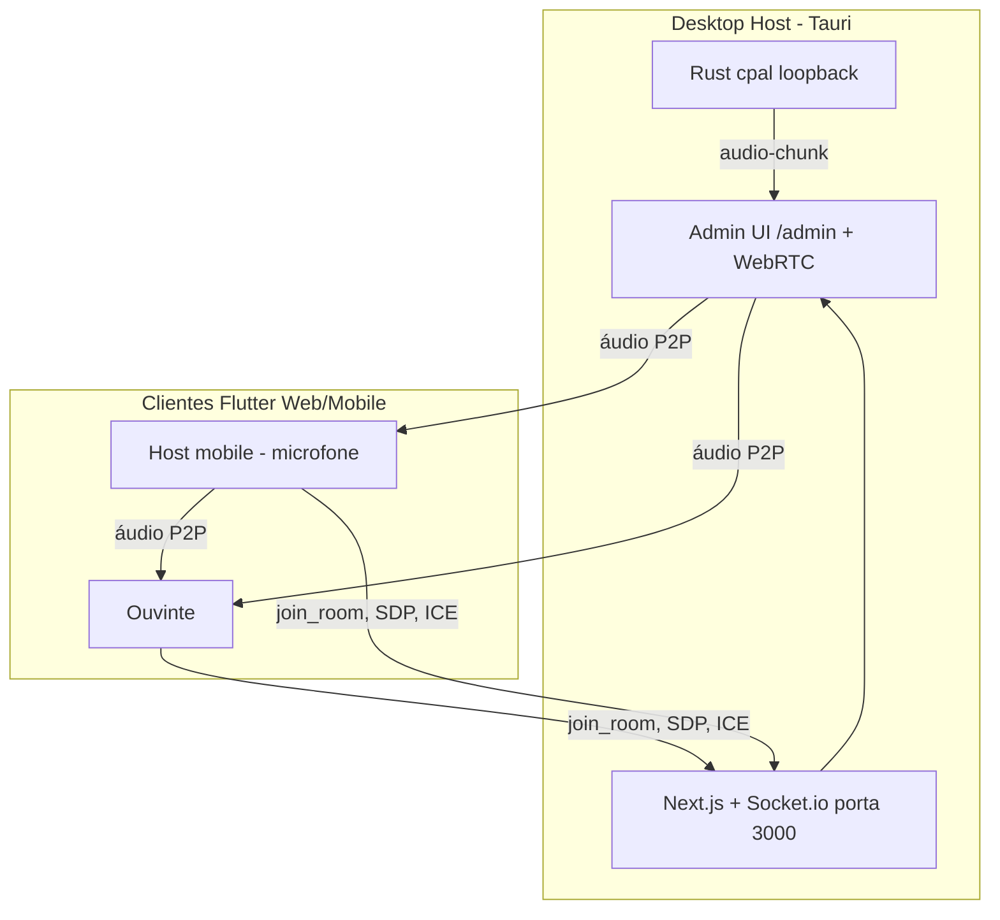

# Sintonize

Sistema de transmissão de áudio em rede local (LAN) para acessibilidade em ambientes compartilhados — salas de aula, teatros, reuniões e igrejas. Um computador atua como estação central e transmite o áudio do ambiente; os participantes entram pelo celular ou navegador e ouvem com latência mínima.

Tudo funciona 100% na rede local, sem depender de internet e sem servidores externos. O transporte de mídia usa WebRTC em malha ponto a ponto (Mesh P2P) e a sinalização usa Socket.io.

As especificações completas estão em `[specs/](specs/)`.

## Arquitetura




O projeto é um monorepo:


| Pacote                               | Descrição                                                                                                                        |
| ------------------------------------ | -------------------------------------------------------------------------------------------------------------------------------- |
| `[apps/web](apps/web)`               | Next.js com servidor customizado: Signaling Server (Socket.io), Admin UI (`/admin`) e distribuição do cliente Flutter Web (`/`). |
| `[apps/desktop](apps/desktop)`       | App Tauri 2.x (Rust) que captura o áudio de loopback do sistema e abre a Admin UI como Estação Central.                          |
| `[apps/client](apps/client)`         | App Flutter (Web, iOS, Android) — onboarding e Room View para ouvintes e hosts.                                                  |
| `[packages/shared](packages/shared)` | Tipos TypeScript e constantes compartilhadas (eventos Socket.io, `RoomUser`, etc.).                                              |


## Pré-requisitos


| Ferramenta   | Versão mínima                             | Necessária para                 |
| ------------ | ----------------------------------------- | ------------------------------- |
| Node.js      | 20+                                       | Servidor web e signaling        |
| pnpm         | 9+ (via `corepack enable pnpm`)           | Gerenciar o monorepo            |
| Flutter      | 3.24+                                     | Cliente Flutter (Web/mobile)    |
| Rust + Cargo | estável (via [rustup](https://rustup.rs)) | Compilar o Desktop Host (Tauri) |


O Desktop Host (Tauri) só é necessário se você for transmitir o áudio do próprio computador. Para desenvolver ou testar apenas a sinalização, a Admin UI e o cliente, o Node é suficiente (veja o modo alternativo abaixo).

### Dependências de captura de loopback por sistema operacional

A captura do áudio do sistema depende de um dispositivo de loopback:


| SO      | Como habilitar o loopback                                                                                                                                        |
| ------- | ---------------------------------------------------------------------------------------------------------------------------------------------------------------- |
| macOS   | Instale o [BlackHole 2ch](https://existential.audio/blackhole/) e crie um "Dispositivo Agregado" no Utilitário de Áudio e MIDI combinando a saída e o BlackHole. |
| Windows | Habilite o "Stereo Mix" em Configurações de Som > Gravação, ou instale o [VB-Audio Cable](https://vb-audio.com/Cable/).                                          |
| Linux   | Use o monitor do PipeWire/PulseAudio. Ex.: `pactl load-module module-loopback`, e selecione o dispositivo "Monitor of ...".                                      |


Se não houver loopback disponível, a sala continua funcionando: o Desktop Host apenas não transmite, mas ouvintes e hosts mobile ainda se comunicam.

## Instalação

```bash
# 1. Dependências do monorepo (Node)
corepack enable pnpm
pnpm install

# 2. Dependências do cliente Flutter
cd apps/client && flutter pub get && cd ../..
```


## Executar como Transmissor (Desktop Host)

Este é o fluxo completo, com captura do áudio do sistema pelo app nativo.

```bash
pnpm dev:desktop
```

O comando inicia o servidor Next.js e abre a janela "Sintonize — Estação Central" apontando para a Admin UI. A Admin UI mostra o QR Code com o endereço da sala, a lista de dispositivos conectados e as ações administrativas.

Antes de transmitir, configure o loopback do seu sistema conforme a tabela de pré-requisitos.


| SO      | Comando            | Observação de loopback                              |
| ------- | ------------------ | --------------------------------------------------- |
| macOS   | `pnpm dev:desktop` | Selecione o dispositivo agregado com BlackHole.     |
| Windows | `pnpm dev:desktop` | Habilite Stereo Mix ou use VB-Audio Cable.          |
| Linux   | `pnpm dev:desktop` | Selecione o "Monitor of ..." (PipeWire/PulseAudio). |


### Modo alternativo sem Tauri (sem Rust)

Para testar sinalização, Admin UI e cliente sem compilar o app nativo:

```bash
# Compila o cliente Flutter Web e integra ao Next.js
pnpm build:client

# Sobe o servidor (signaling + Admin UI + cliente)
pnpm dev:web
```

- Admin UI: `http://localhost:3000/admin`
- Cliente: `http://localhost:3000/`
- Saúde do servidor: `http://localhost:3000/health`

Neste modo não há captura de áudio do computador (isso é responsabilidade do Tauri), mas você pode transmitir usando um celular com perfil Host.

## Conectar outros dispositivos como Ouvintes

1. Garanta que o dispositivo está na **mesma rede Wi-Fi/Ethernet** do Desktop Host.
2. **Escaneie o QR Code** exibido na Admin UI, ou digite o endereço manualmente no navegador do celular (ex.: `http://192.168.1.42:3000`).
3. Complete o onboarding: informe o nome e escolha o perfil **Ouvinte**.
4. Toque em "Entrar na Sala". O áudio começa a tocar (o toque conta como interação, liberando a reprodução automática do navegador).

Para transmitir do celular, escolha o perfil **Host** no onboarding e permita o acesso ao microfone quando solicitado.

## Testes com múltiplos dispositivos

Descubra o IP do Desktop Host pela Admin UI (ou, em modo `dev:web`, use o IP da máquina na LAN em vez de `localhost` para acessar de outros aparelhos).


| Cenário                     | Como testar                                                           | Resultado esperado                                                                |
| --------------------------- | --------------------------------------------------------------------- | --------------------------------------------------------------------------------- |
| 1 transmissor + 1 ouvinte   | Inicie o Desktop Host e conecte 1 celular via QR Code como Ouvinte.   | O ouvinte escuta o áudio do computador com latência baixa.                        |
| 1 transmissor + N ouvintes  | Conecte vários celulares/navegadores como Ouvintes.                   | Todos escutam simultaneamente; a Admin UI lista cada um.                          |
| Host mobile + ouvintes      | Conecte o celular A como Host (microfone) e o celular B como Ouvinte. | O ouvinte escuta o microfone do celular A (e o loopback do Desktop, se ativo).    |
| Reconexão                   | Desligue o Wi-Fi de um ouvinte por ~10s e religue.                    | O app mostra "Reconectando…" e volta sem duplicar o usuário na lista da Admin UI. |
| Ações administrativas       | Na Admin UI, renomeie, silencie e remova um participante.             | As mudanças refletem em tempo real; o participante removido volta ao onboarding.  |
| Sala cheia                  | Conecte mais de 20 participantes.                                     | Novas entradas recebem a mensagem de sala cheia (`ROOM_FULL`).                    |
| Proteção da Estação Central | Tente remover/silenciar a "Estação Central" na Admin UI.              | A ação é rejeitada — o Desktop Host não pode ser modificado.                      |


Dica: no mesmo computador, você pode abrir várias abas anônimas do navegador em `http://<IP>:3000` para simular vários ouvintes rapidamente.

## Solução de problemas


| Sintoma                                         | Causa provável                                 | Ação                                                                                                                            |
| ----------------------------------------------- | ---------------------------------------------- | ------------------------------------------------------------------------------------------------------------------------------- |
| Status "Conectado" mas sem áudio                | Reprodução automática bloqueada pelo navegador | Toque na tela / botão da Room View para iniciar o áudio.                                                                        |
| Não conecta após ~10s ("Isolamento de Cliente") | AP Isolation no roteador                       | Desative "Isolamento de Cliente"/"Client Isolation" no roteador.                                                                |
| Microfone não funciona no navegador             | `getUserMedia` exige contexto seguro em HTTP   | Use o app nativo, ou habilite a flag `chrome://flags/#unsafely-treat-insecure-origin-as-secure` adicionando `http://<IP>:3000`. |
| Sem áudio do computador                         | Loopback não configurado                       | Configure BlackHole (macOS), Stereo Mix/VB-Cable (Windows) ou o Monitor (Linux).                                                |
| Dispositivos não se enxergam                    | Firewall bloqueando                            | Libere a porta TCP 3000 e a faixa UDP efêmera (49152–65535).                                                                    |
| Lista de participantes duplicada                | Reconexão sem o mesmo identificador            | Verifique se o cache do cliente não foi apagado entre reconexões.                                                               |


## Scripts úteis


| Comando              | Descrição                                                      |
| -------------------- | -------------------------------------------------------------- |
| `pnpm dev:web`       | Sobe o servidor Next.js (signaling + Admin UI + cliente).      |
| `pnpm dev:desktop`   | Sobe o servidor e abre a Estação Central (Tauri).              |
| `pnpm dev:client`    | Roda o cliente Flutter em modo de desenvolvimento no Chrome.   |
| `pnpm build:client`  | Compila o Flutter Web e o integra em `apps/web/public/client`. |
| `pnpm build:web`     | Build de produção do Next.js.                                  |
| `pnpm build:desktop` | Empacota o Desktop Host (Tauri).                               |


## Limitações do MVP

- Sem autenticação: qualquer dispositivo na LAN pode entrar na sala. Premissa aceita em ambientes controlados.
- Sem TURN/SFU: em redes com AP Isolation a conexão P2P falha (mensagem específica é exibida).
- Malha P2P: a banda do transmissor cresce com o número de participantes. Limite de 20 participantes, com aviso de carga na Admin UI.
- HTTP sem HTTPS: `getUserMedia` pode ser bloqueado em alguns navegadores (ver solução de problemas).

